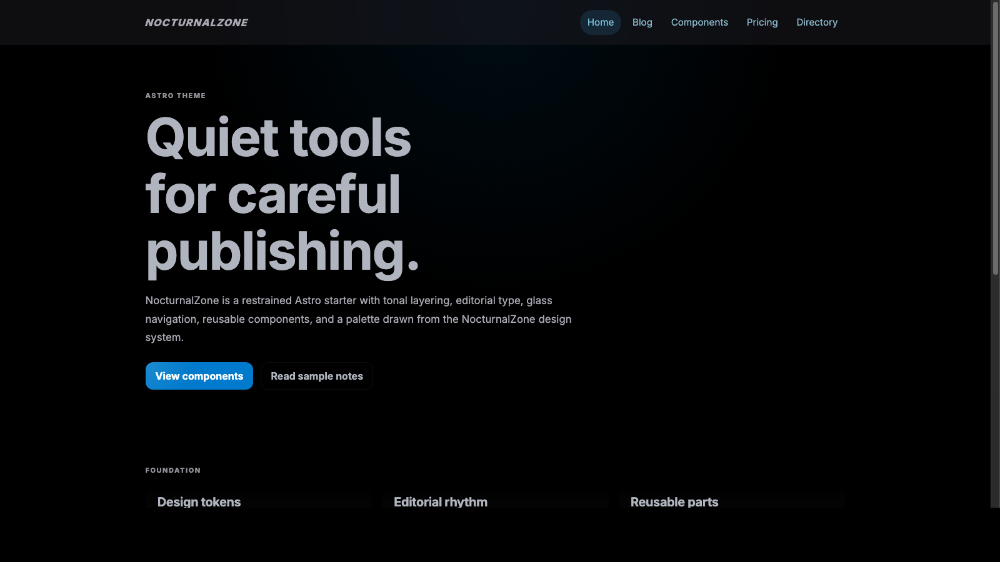

# NocturnalZone Astro Theme

An Astro starter for quiet editorial sites, product directories, and technical notes.



## Use

```bash
npm create astro@latest my-site -- --template noxyzone/nocturnalzone-astro-theme
```

Then edit `astro.config.mjs` and set `site` to your production URL.

## Local Development

```bash
npm install
npm run dev
```

## Production Build

```bash
npm run build
npm run preview
```

`npm run dev` starts the local development server with live reload. `npm run build`
checks and writes the production output to `dist/`, and `npm run preview` serves
that built output locally before deployment.

## Included

- CSS-variable theme tokens with dark and light color schemes
- Editorial layout, glass header, prose, cards, buttons, badges, tables, and forms
- Reusable Astro components under `src/theme`
- Sample pages for a homepage, blog, component gallery, pricing, and directory views
- Reusable SEO head component

Sitemap generation is intentionally left to the consuming project. Add `@astrojs/sitemap`
and set the production `site` URL in `astro.config.mjs` when publishing.

## Structure

```text
src/theme/
  components/
  layouts/
  styles/
src/pages/
  blog/
  blog.astro
  components.astro
  directory.astro
  index.astro
  pricing.astro
```

Keep project-specific data fetching outside `src/theme`. The theme layer is intentionally
portable: it provides visual primitives, layout, and metadata helpers.

## License

MIT
